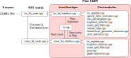

# plain_slam_ros2

**plain_slam_ros2** is a ROS 2 package for LIO, LiDAR SLAM, and localization, built upon a minimal and modular SLAM system. The implementation is concise - its core C++ source code contains fewer than **1,800 lines**, excluding blank lines and comments.

Despite its simplicity, **plain_slam_ros2** provides the following key features:

- Both loosely and tightly coupled approaches for LIO
- Loop detection based on GICP
- Pose graph optimization for global consistency
- Point-cloud-map-based localization using the same approaches as LIO

The core SLAM logic is independent of ROS 2 and relies only on **Sophus** (which in turn depends on **Eigen**), **nanoflann**, and **YAML** (used for parameter loading).


**LIO (Localization) example**

The white points represent the local map used in LIO. When operating in localization mode, this can correspond to the global map.


**SLAM example**


**The SLAM result on the Newer College Dataset** 🔗 [Newer College Dataset Website](https://ori-drs.github.io/newer-college-dataset/)

**Note:** This result was obtained using **ROS 1**.


## Required Messages and Supported Sensors

**plain_slam_ros2** requires the following ROS 2 messages:

- `sensor_msgs::msg::PointCloud2`
- `sensor_msgs::msg::Imu`

Currently, Livox and Ouster LiDAR sensors are officially supported.

If you wish to use a different LiDAR sensor, you can either:

1. Add custom parsing logic for `PointCloud2` messages in `src/lio_3d_node.cpp` (see examples in `src/ros_utils.cpp`), or  
2. Set `lidar_type` to `your_lidar` in `config/lio_3d_config.yaml`, and publish `PointCloud2` messages with the following fields:
   - `x: Float32`
   - `y: Float32`
   - `z: Float32`
   - `intensity: Float32`
   - `timestamp: Float64`


## Install

**Note:** This package has been tested on **Ubuntu 22.04** with **ROS 2 Humble**.

**YAML and Eigen**

```sh
sudo apt update
sudo apt install libyaml-cpp-dev
sudo apt install libeigen3-dev
```

**nanoflann**

```sh
git clone https://github.com/jlblancoc/nanoflann.git
sudo cp -r nanoflann/include/nanoflann.hpp /usr/local/include/
```

**nanoflann** can be installed via `apt`, but this may lead to version issues. **plain_slam_ros2** requires version **1.6.0 or higher**.

**Sophus**

```sh
git clone https://github.com/strasdat/Sophus.git
cd Sophus
mkdir build && cd build
cmake ..
make -j$(nproc)
sudo make install
```

**plain_slam_ros2**

```sh
cd your/ros2_ws/src/
git clone https://github.com/NaokiAkai/plain_slam_ros2.git
cd your/ros2_ws/
colcon build
source install/setup.bash
```


## How to use

### LIO

Please edit `config/lio_3d_config.yaml` to match your environment. Then, launch `lio_3d.launch.py`. Don't forget to run `colcon build` after editing the config files.

```sh
ros2 launch plain_slam_ros2 lio_3d.launch.py
rviz2 -d config/lio_3d.rviz
```

### SLAM

Please edit `config/slam_3d_config.yaml` to match your environment as well. Then, launch `slam_3d.launch.py`.

```sh
ros2 launch plain_slam_ros2 slam_3d.launch.py
rviz2 -d config/slam_3d.rviz
```

**Note:** To use SLAM, make sure that `use_as_localizer` in `config/lio_3d_config.yaml` is set to `false`.

### Localization

**plain_slam_ros2** does not depend on PCL, but it can load and save `.pcd` files (handled via custom lightweight I/O code).

We assume your `.pcd` files are located in `/tmp/pslam_data/` (the default setting).

To use the system as a localizer, set `use_as_localizer: true` in `config/lio_3d_config.yaml`, and set `map_cloud_dir` to the directory containing your `.pcd` files. Then, launch `lio_3d.launch.py`.

**CAUTION:** The localizer computes a transformation from the odometry to IMU frames (`odom → imu`), but **does not** compute a transformation from the map frame to the odometry frame.

If you want to construct a standard transformation tree for navigation, such as `map → odom → base_link → sensor`, you must manually define a static identity (zero) transformation between `map` and `odom` (e.g., using `static_transform_publisher`) and set the frame ID from `imu` to `base_link`.


## Overview



The main source files of Plain SLAM are organized into an **interface layer** and **core modules**, as illustrated in the overview figure. The total C++ implementation of the Plain SLAM components consists of fewer than 1,800 lines of code, excluding blank lines and comments.

The result of the code analysis using `cloc` is as follows (executed via `code_stats.sh`):

```
===== plain_slam total C++ code information (excluding ROS2-related code) =====
      27 text files.
      27 unique files.                              
       0 files ignored.

github.com/AlDanial/cloc v 1.90  T=0.01 s (2287.9 files/s, 331836.2 lines/s)
-------------------------------------------------------------------------------
Language                     files          blank        comment           code
-------------------------------------------------------------------------------
C++                             13            398            371           1793
C/C++ Header                    14            281            324            749
-------------------------------------------------------------------------------
SUM:                            27            679            695           2542
-------------------------------------------------------------------------------
```

**Note:** The header files contain many inline accessor methods (e.g., setters and getters), but no core processing logic is implemented in them.


## License

**plain_slam_ros2** is publicly available software, provided free of charge for academic and personal use only. Commercial use is not permitted without prior written permission from the author. See [LICENSE.txt](./LICENSE.txt) for full terms.
